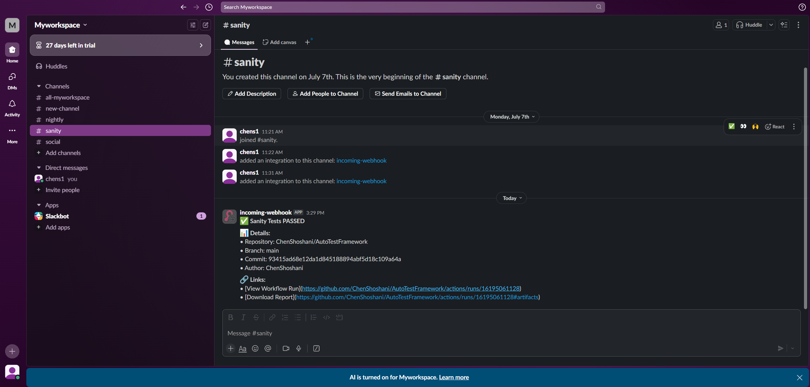

# AutoTestFramework

**Complete UI & API Test Automation Framework with Full CI/CD Integration**


---

## Project Overview

Demonstrating capabilities in building a comprehensive **automation framework** that includes UI and API testing, HTML reporting, automated pipeline, and Slack notifications.

This project focuses on **infrastructure** and **best practices** for test automation.

---

## Core Technologies

| Technology | Purpose | Version |
|-----------|---------|---------|
| **Python** | Main development language | 3.8+ |
| **Selenium** | UI testing framework | 4.34.0 |
| **Pytest** | Test runner and framework | 8.4.1 |
| **Requests** | REST API testing | 2.32.4 |
| **GitHub Actions** | CI/CD pipeline | - |
| **pytest-html** | HTML reporting | - |

---

## Project Structure

```
AutoTestFramework/
├── api/                      # API clients
├── pages/                    # Page Object Models
├── tests/                    # Test files (UI, API)
├── utils/                    # Utility and configuration files
├── config/                   # Main configuration files
├── .github/workflows/        # GitHub Actions Pipeline
├── reports/                  # HTML reports
├── conftest.py              # Pytest fixtures
├── pytest.ini              # Pytest configuration
├── run_tests.bat            # Quick execution scripts
└── README.md
```

---

## Local Test Execution

### 1. Clone and Install Dependencies
```bash
git clone https://github.com/ChenShoshani/AutoTestFramework.git
cd AutoTestFramework

# Create virtual environment
python -m venv venv
source venv/bin/activate       # Linux/Mac
venv\Scripts\activate          # Windows

# Install dependencies
pip install -r requirements.txt
```

### 2. Running Tests

#### UI Tests
```bash
pytest tests/test_ui/ -v
pytest tests/test_ui/ --html=reports/ui_report.html --self-contained-html -v
```

#### API Tests
```bash
pytest tests/test_api/ -v
```

#### By Markers
```bash
pytest -m sanity -v
pytest -m nightly -v
```

#### Execution Scripts
```bash
# Windows
run_tests.bat
```

---

## CI/CD Pipeline (GitHub Actions)

### Sanity Run
- **Trigger**: Every push to main and pull request
- **What runs**: Only tests marked with `@pytest.mark.sanity`
- **Purpose**: Quick execution for critical issue detection

### Nightly Run
- **Trigger**: Daily at 02:00 UTC
- **What runs**: All tests (`@pytest.mark.nightly`)
- **Purpose**: Comprehensive coverage of entire infrastructure

### Manual Run
- **Trigger**: Manual workflow dispatch
- **What runs**: All tests with custom parameters
- **Purpose**: On-demand testing for development

---

## Slack Notifications

The framework includes an advanced Slack notification system with complete test result details:

### Notification Types

| Run Type | Webhook | Description |
|----------|---------|-------------|
| **Sanity Tests** | `SLACK_WEBHOOK_SANITY` | Notifications for quick tests |
| **Nightly Tests** | `SLACK_WEBHOOK_NIGHTLY` | Notifications for nightly runs |
| **Manual Tests** | `SLACK_WEBHOOK_MANUAL` | Notifications for manual runs |

### What Each Notification Includes
- **Test status** - Success or failure
- **Run details** - Repository, Branch, Commit, Author
- **Useful links**:
  - **View Workflow Run** - Navigate to GitHub run page
  - **Download Report** - Download detailed HTML report
- **Action instructions** - In case of failure

### Slack Notification Example



### Webhook Setup

1. Create a new Slack App or use existing one
2. Enable Incoming Webhooks
3. Add Webhook URLs as GitHub Secrets:
   - `SLACK_WEBHOOK_SANITY` - For quick tests
   - `SLACK_WEBHOOK_NIGHTLY` - For nightly runs
   - `SLACK_WEBHOOK_MANUAL` - For manual runs

### Notification System Benefits
- **Immediacy** - Instant notification to all team members
- **Detailed** - All required information for quick resolution
- **Traceability** - Complete history of all test runs
- **Automation** - No need for manual GitHub checking

---

## Configuration (config/config.json)

```json
{
  "base_url": "https://www.ynet.co.il",
  "api_base_url": "https://jsonplaceholder.typicode.com",
  "browser": "chrome",
  "headless": false,
  "timeout": 10,
  "environment": "demo"
}
```

---

## Test Markers

| Marker | Description | Usage |
|--------|-------------|-------|
| `@pytest.mark.ui` | UI tests | `pytest -m ui` |
| `@pytest.mark.api` | API tests | `pytest -m api` |
| `@pytest.mark.sanity` | Critical and fast tests | `pytest -m sanity` |
| `@pytest.mark.nightly` | Comprehensive nightly tests | `pytest -m nightly` |
| `@pytest.mark.smoke` | Smoke tests | `pytest -m smoke` |

---

## HTML Reports

```bash
pytest tests/ --html=reports/test_report.html --self-contained-html -v
```

**Report includes:**
- Details for each test (Pass/Fail)
- Execution times
- Stack traces for errors
- System details
- Overall statistics

---

## Features

### ✅ Page Object Model
- Clean separation of test logic and page elements
- Reusable page components
- Maintainable test structure

### ✅ Configuration Management
- Centralized configuration
- Environment-specific settings
- Easy parameter management

### ✅ Advanced Reporting
- HTML reports with detailed information
- Screenshots on failure
- Test execution metrics

### ✅ CI/CD Integration
- Automated test execution
- Multiple trigger types
- Artifact management

### ✅ Slack Integration
- Real-time notifications
- Detailed run information
- Direct links to results

---

## Getting Started

1. **Clone the repository**
2. **Install dependencies** using `pip install -r requirements.txt`
3. **Configure** test parameters in `config/config.json`
4. **Run tests** using pytest or execution scripts
5. **View results** in HTML reports or Slack notifications

---

## Contributing

1. Fork the repository
2. Create a feature branch
3. Make your changes
4. Add tests for new functionality
5. Submit a pull request

---

## License

This project is created for demonstration purposes as part of a test automation showcase.

---

## Contact

For questions or suggestions, please open an issue on GitHub.


